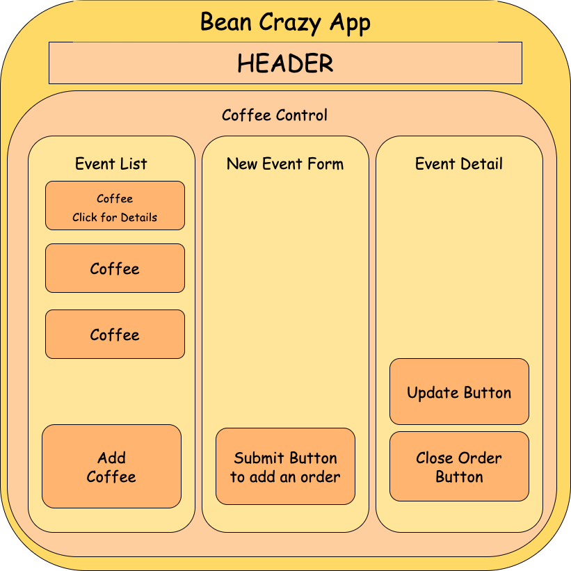

# Bean Crazy Coffee House

#### Greg Khmara

#### This is a React Application that allows users to create and edit orders

## Technologies Used

* React
* JavaScript
* HTML
* NPM

## Description

This site allows a user to create and edit a coffee order. They can also edit their order and delete it as well.

## Setup/Installation Requirements

* Clone the repo from Github
* Navagate to root project folder *bean-crazy* within the terminal or console
* Type to terminal or console: *npm install *npm start 
* Site will automatically open in browser

## Known Bugs

* No known bugs.

## License

MIT License

Copyright (c) 06-20-22 Greg Khmara

Permission is hereby granted, free of charge, to any person obtaining a copy
of this software and associated documentation files (the "Software"), to deal
in the Software without restriction, including without limitation the rights
to use, copy, modify, merge, publish, distribute, sublicense, and/or sell
copies of the Software, and to permit persons to whom the Software is
furnished to do so, subject to the following conditions:

The above copyright notice and this permission notice shall be included in all
copies or substantial portions of the Software.

THE SOFTWARE IS PROVIDED "AS IS", WITHOUT WARRANTY OF ANY KIND, EXPRESS OR
IMPLIED, INCLUDING BUT NOT LIMITED TO THE WARRANTIES OF MERCHANTABILITY,
FITNESS FOR A PARTICULAR PURPOSE AND NONINFRINGEMENT. IN NO EVENT SHALL THE
AUTHORS OR COPYRIGHT HOLDERS BE LIABLE FOR ANY CLAIM, DAMAGES OR OTHER
LIABILITY, WHETHER IN AN ACTION OF CONTRACT, TORT OR OTHERWISE, ARISING FROM,
OUT OF OR IN CONNECTION WITH THE SOFTWARE OR THE USE OR OTHER DEALINGS IN THE
SOFTWARE.